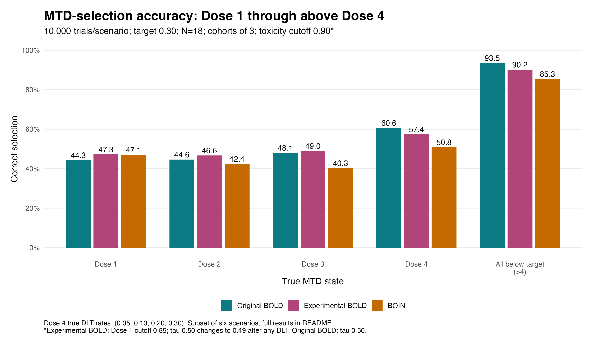

# Bayesian Ordered Lattice Design (BOLD) Phase I Trial Simulator

**Version 1.1.0** | Authors: Wanru Guo, Gi-Ming Wang, and Curtis Tatsuoka

[Open the public Shiny app](https://wguo3.shinyapps.io/bold_boin_phase1_app/)

Research software for comparing BOLD and BOIN through simulated Phase I trials. No real patient data are required. This is an independent implementation, not the MD Anderson BOIN app or a validated live clinical dose-assignment system.

## General use

1. Open **Run simulation** and choose the number of dose levels (2-10) and starting dose. Both methods use these settings.
2. Choose all scenarios or a single scenario. Enter nondecreasing **true DLT probabilities** for every dose. These are hypothetical simulation truths, not prior beliefs supplied to either algorithm. Inspect and edit generated example scenarios, especially after changing the dose count or target.
3. Set the shared target DLT rate, cohort size, maximum patients, stopping limit, toxicity cutoff, number of simulation trials, and random seed.
4. Set BOLD's PPAT selection target `tau` (default 0.50) and common prior effective sample size (PESS, default 3).
5. Optionally check the BOLD dose-specific customization boxes and enter prior means, PESS, toxicity cutoffs, or stopping limits for each dose. **Checked: per-dose entries override that BOLD default. Unchecked: BOLD returns to the common default.** BOIN continues to use the shared stopping limit and toxicity cutoff.
6. Select BOIN's stopping mode. The matched/stable-dose mode stops at the per-dose limit only when the next recommendation remains at that dose; the standard mode stops when the limit is reached. Report the selected mode with results.
7. Click **Run comparison**. Review accuracy, dose-selection percentages, sample size and its SD, DLT counts, and overdose allocation. Download the CSV bundle, including scenario definitions and design parameters. Results describe the last completed run; rerun after changing inputs.

BOLD's prior is `Beta(m_j * q_j, m_j * (1 - q_j))`. Here `q_j` is the anticipated DLT probability and `m_j` is prior information weight, not a number of actual patients to enroll. Actual enrollment is controlled by cohort size. With customization off, prior means equal the target DLT rate. These are weak target-centered priors, not literally information-free priors.

The target DLT rate, BOLD's PPAT target, and toxicity-exclusion cutoff are different quantities. BOIN retains its decision boundaries and separate Bayesian safety check; it does not use BOLD's priors. Input validation does not replace statistical review.

### Run locally

From this repository folder in R:

```r
install.packages(c("shiny", "bslib", "ggplot2", "Iso", "BOIN"))
shiny::runApp()
```

Run regression checks with:

```r
for (f in list.files("tests", pattern = "[.]R$", full.names = TRUE)) source(f)
```

Large runs may exceed hosted resource limits; use local R for extensive sensitivity analyses.

## CD229 CAR-T design example

This example concerns design evaluation for a proposed first-in-human CD229 CAR-T study, with doses of **0.5, 1, 2, and 4 million viable CAR-positive T cells/kg**. The study team's request emphasized evaluating the possibility that the highest available dose is the true MTD, while retaining cohort and sentinel safeguards. This is a scenario of interest, **not evidence that the highest dose is safe, a known MTD, or a widely established clinical belief**. The simulations do not model sentinel timing or delayed toxicity.

To examine the revised highest-dose scenario, select four doses, start at Dose 1, choose the Dose 4 true-MTD scenario, and enter **(0.05, 0.10, 0.20, 0.30)**. Set target 0.30, cohorts of 3, maximum 18 patients, stable-dose stopping limit 12, cutoff 0.90, BOLD tau 0.50, prior means 0.30, and PESS 3 at every dose. Set 10,000 trials for greater Monte Carlo precision. This revised vector is **not** the app's original Dose 4 default `(0.03, 0.05, 0.10, 0.25)`.

### Selected results: Dose 2 through above Dose 4



This is a **selected subset** of a six-scenario, 10,000-trial-per-scenario analysis, not clinical outcomes. Complete results, including lower-dose scenarios, true DLT vectors, and overdose allocation, are in [the results CSV](docs/data/car_t_six_scenarios.csv).

| True state | True DLT probabilities | Original BOLD | Experimental BOLD | BOIN |
|---|---|---:|---:|---:|
| Dose 2 | 0.10, 0.25, 0.40, 0.50 | 44.13% | 45.11% | 44.56% |
| Dose 3 | 0.05, 0.10, 0.25, 0.40 | 49.21% | 49.30% | 42.21% |
| Dose 4 | 0.05, 0.10, 0.20, 0.30 | 60.64% | 57.37% | 50.83% |
| All below target (>4) | 0.03, 0.05, 0.10, 0.15 | 93.49% | 90.15% | 85.34% |

**Original BOLD had higher correct-selection rates than BOIN at Dose 3, Dose 4, and in the all-below-target scenario**, including a 9.81-percentage-point advantage at Dose 4. Dose 2 was essentially similar and slightly favored BOIN over original BOLD. For `>4`, success means selecting the highest available dose, not identifying an untested dose above Dose 4.

The advantage is scenario-dependent: when all doses were too toxic, original BOLD correctly selected no dose in 39.77% of simulations versus 61.15% for BOIN; at true Dose 1, rates were 43.27% versus 50.40%. BOLD also allocated more patients above the designated MTD in some scenarios. Consider accuracy alongside safety, allocation, and sample size, not as universal superiority. Accuracy Monte Carlo standard errors are approximately 0.25-0.50 percentage points in this saved analysis.

**Experimental BOLD is a separate research variant**, not the published BOLD method and not an app option. It lowers the Dose 1 cutoff to 0.85 and changes tau from 0.50 to 0.49 after any DLT; other cutoffs remain 0.90. The app cannot reproduce this dynamic tau rule by setting a constant tau. This figure is a saved standalone analysis, not a new run of the current app. Labels use consistent rounding from the CSV (90.15% displays as 90.2%).

Recreate the figure without rerunning simulations:

```r
source("docs/plot_car_t.R")
```

## Methods and limitations

See [METHODS_AUDIT.md](METHODS_AUDIT.md) for original source-parity checks and their limits. Version 1.1.0 adds configurable dose counts and BOLD priors, cutoffs, and stopping limits with regression tests; these are not independent clinical validation of all configurations. Prespecify and clinically justify simulation truths. Do not tune parameters solely to make one design outperform another.

Default scenario rates are assumptions, not patient estimates or values copied from the paper. Overdose allocation here means the proportion of simulated participants treated above the designated true MTD, not the observed DLT rate. The paper's upper delta refers to the dose above the MTD; separation from the dose below is different.

This app is not evidence of FDA approval or readiness for clinical deployment. Regulatory use requires study-team approval and independent statistical and code review. Do not upload real patient data to the public app.

## Sources and citation

- [BOLD methods paper](https://doi.org/10.1002/sim.70456)
- [BOLD authors' code](https://github.com/hiddenmanna1996/BOLD)
- [BOIN R package](https://cran.r-project.org/package=BOIN)
- [MD Anderson BOIN app](https://biostatistics.mdanderson.org/shinyapps/BOIN/)

Guo W, Wang G-M, Tatsuoka C. *Bayesian Ordered Lattice Design (BOLD) Phase I Trial Simulator*. Version 1.1.0. Zenodo; 2026. [https://doi.org/10.5281/zenodo.22888835](https://doi.org/10.5281/zenodo.22888835). See [Zenodo's versioned record](https://doi.org/10.5281/zenodo.22867492) for all releases. Version 1.0.0 remains available at [its original DOI](https://doi.org/10.5281/zenodo.22867493).

Wang G-M, Tatsuoka C. Bayesian Ordered Lattice Design for Phase I Clinical Trials. *Statistics in Medicine*. 2026;45(6-7):e70456. https://doi.org/10.1002/sim.70456.
