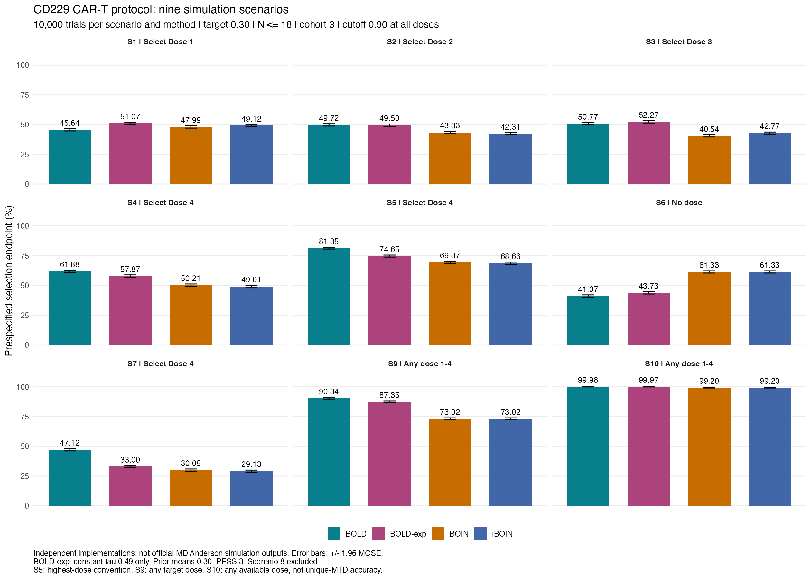

# Bayesian Ordered Lattice Design (BOLD) Phase I Trial Simulator

Authors: **Wanru Guo, Gi-Ming Wang, and Curtis Tatsuoka**

[Public Shiny app](https://wguo3.shinyapps.io/bold_boin_phase1_app/) | [Methods audit](METHODS_AUDIT.md)

Independent research software for BOLD, BOIN and iBOIN simulations. This is **not an official authors' or MD Anderson app**, and is not a validated clinical dose-assignment system. No real patient data are required.

**September 23 development update:** nine protocol scenarios and an independent iBOIN implementation are being validated. The public app and existing Zenodo archive may still contain the preceding version; see the publication status in the methods audit.

## General use

1. Choose the number of doses (2-10), starting dose, scenarios and methods. Four-dose defaults use the protocol scenarios below. Other dose counts use illustrative editable scenarios.
2. Enter nondecreasing true DLT probabilities. These generate simulated outcomes; the methods do not know them. They are different from prior means.
3. Set the target DLT probability, cohort size, total patient maximum, per-dose stopping limit, toxicity cutoff, trial count and seed. The matched stopping rule requires reaching the dose limit **and** recommending that same dose again.
4. Set BOLD's tau, prior means and PESS. Checked dose-specific controls override the corresponding common BOLD values. BOIN/iBOIN retain the shared cutoff and stopping limit.
5. For iBOIN, set its separate prior means and **integer PESS**, optionally by dose. Prior means default to the target, PESS to 3. Its final-selection prior option defaults to on. BOIN has no favored-dose prior. iBOIN PESS 0 at every dose reduces to the implemented BOIN rules.
6. Optionally include BOLD-exp: **constant tau 0.49**, with all other BOLD settings unchanged. This replaces the older experimental rule that changed Dose 1's cutoff and switched tau after a DLT. It is a research sensitivity analysis, not the published BOLD method.
7. Run the comparison. Review the named endpoint, MCSE, full selection distribution, patient allocation, DLT count and overdose allocation. Download the CSV bundle for inputs and outputs. Edited inputs do not change an already displayed result until rerun.

With defaults, BOLD's prior is Beta(0.9,2.1): prior mean 0.30 and PESS 3. Favoring a dose by increasing PESS does not change the actual cohort size. These are weak priors, not an absence of prior information.

### iBOIN implementation and safety

This repository implements the published prior-weight and decision-boundary equations, with prior-augmented final estimates, inverse-variance isotonic regression, and the BOIN tie convention. **The uniform Beta(1,1) safety check uses the selected shared cutoff at every dose, during allocation and at final selection.** Safety exclusions override final-selection priors. This is an explicit matched-safety implementation, not a claim of exact MD Anderson web-app equivalence.

Earlier official-web-app iBOIN results are **not reused as matched-0.90 results**. During verification, the app's decision table and simulation/final-selection behavior did not agree on safety handling. See the [audit](docs/IBOIN_VALIDATION.md). Exact flat truths are supported locally without perturbing their probabilities.

### Run locally

```r
install.packages(c("shiny", "bslib", "ggplot2", "Iso", "BOIN"))
shiny::runApp()
```

From the repository directory, run tests and reproduce the protocol comparison:

```r
for (f in list.files("tests", pattern = "[.]R$", full.names = TRUE)) source(f)
source("docs/run_protocol.R")  # 10,000 trials per scenario and method
source("docs/plot_protocol.R") # rebuild figure/table from saved CSVs only
```

## CD229 CAR-T design example

These are **hypothetical protocol stress tests**, not CD229 toxicity estimates or clinical validation. The four dose levels are 0.5, 1, 2 and 4 million viable CAR-positive T cells/kg. Interest in a higher MTD is a design motivation, not evidence that higher doses are safe. Sentinel timing, delayed toxicity, efficacy and RP2D decisions are not modeled.

The table retains the protocol numbering: **Scenario 8 is excluded**, leaving nine scenarios. Default target is 0.30.

| Scenario | Dose 1 | Dose 2 | Dose 3 | Dose 4 | Primary displayed endpoint |
|---|---:|---:|---:|---:|---|
| 1 | 0.30 | 0.40 | 0.50 | 0.60 | Select Dose 1 |
| 2 | 0.15 | 0.30 | 0.45 | 0.60 | Select Dose 2 |
| 3 | 0.05 | 0.15 | 0.30 | 0.45 | Select Dose 3 |
| 4 | 0.05 | 0.10 | 0.20 | 0.30 | Select Dose 4 |
| 5 | 0.05 | 0.10 | 0.15 | 0.20 | Select Dose 4 (highest available) |
| 6 | 0.45 | 0.55 | 0.65 | 0.75 | No dose recommendation |
| 7 | 0.15 | 0.20 | 0.25 | 0.30 | Select Dose 4 |
| 9 | 0.30 | 0.30 | 0.30 | 0.30 | Select any dose 1-4 (all at target) |
| 10 | 0.05 | 0.05 | 0.05 | 0.05 | Select any dose 1-4 (all below target) |

Scenarios 9 and 10 have **no unique true MTD**. Scenario 10's endpoint follows the requested any-dose metric; Dose 4 selection is also available in the full selection data. An above-range label never authorizes an untested Dose 5. Scenario 5's Dose 4 endpoint is a highest-available-dose convention. Do not compare different endpoint types as though they measured the same accuracy.

### Nine-scenario performance



[Performance table with MCSE](docs/protocol_results.md) | [Full-precision performance CSV](docs/data/protocol_performance.csv) | [Every dose and no-dose selection](docs/data/protocol_selections.csv) | [Allocation](docs/data/protocol_allocations.csv) | [Exact parameters](docs/data/protocol_parameters.csv)

Entries below are **percentage (MCSE in percentage points)** for the endpoint specified in the scenario table.

| Scenario | BOLD | BOLD-exp | BOIN | iBOIN (independent) |
|---|---:|---:|---:|---:|
| S1 | 45.64 (0.50) | 51.07 (0.50) | 47.99 (0.50) | 49.12 (0.50) |
| S2 | 49.72 (0.50) | 49.50 (0.50) | 43.33 (0.50) | 42.31 (0.49) |
| S3 | 50.77 (0.50) | 52.27 (0.50) | 40.54 (0.49) | 42.77 (0.49) |
| S4 | 61.88 (0.49) | 57.87 (0.49) | 50.21 (0.50) | 49.01 (0.50) |
| S5 | 81.35 (0.39) | 74.65 (0.44) | 69.37 (0.46) | 68.66 (0.46) |
| S6 | 41.07 (0.49) | 43.73 (0.50) | 61.33 (0.49) | 61.33 (0.49) |
| S7 | 47.12 (0.50) | 33.00 (0.47) | 30.05 (0.46) | 29.13 (0.45) |
| S9 | 90.34 (0.30) | 87.35 (0.33) | 73.02 (0.44) | 73.02 (0.44) |
| S10 | 99.98 (0.01) | 99.97 (0.02) | 99.20 (0.09) | 99.20 (0.09) |

All four methods are rerun locally with **10,000 trials per scenario**, start Dose 1, cohorts of 3, maximum N 18, stable-dose limit 12, target 0.30 and **cutoff 0.90 at every dose**. Prior means are 0.30 and PESS 3 at all doses for BOLD and iBOIN. BOLD tau is 0.50, BOLD-exp tau is 0.49. iBOIN final-selection priors are on. Scenario seeds are 20260920 plus 1000 times the row position in the nine-scenario grid. Thus these results need not equal earlier single-scenario runs.

Error bars show +/- 1.96 MCSE, not patient variability or uncertainty in the true toxicity probabilities. Full patient and safety summaries are included; any apparent selection advantage is scenario-dependent, not universal superiority. Review above-target patient allocation as well as selection percentages.

In these matched-safety runs, BOLD selected the target more often than BOIN and independently implemented iBOIN in scenarios 2-4 and 7. For example, Scenario 4 rates were 61.88%, 50.21% and 49.01%, respectively. Conversely, in the all-toxic Scenario 6, BOLD recommended no dose less often (41.07% versus 61.33% for both interval designs). BOLD also allocated more patients above target in scenarios 1-3. The full grid is presented to retain these trade-offs.

### Outcome definitions

- Selection endpoint: number of trials meeting the table's endpoint divided by simulated trials.
- MCSE (percentage points): `100 * sqrt(p * (1-p) / R)`.
- Mean N and SD N: mean and sample SD of enrolled patients across trials.
- Mean DLTs: average observed DLT count per trial.
- Overdose allocation: total patients assigned to doses with **true DLT probability above the target**, divided by total patients across simulations. It is not the DLT rate or the fraction of trials selecting an excessive dose.

## Sources and citation

- [BOLD methods paper](https://doi.org/10.1002/sim.70456) and [authors' code](https://github.com/hiddenmanna1996/BOLD).
- [BOIN R package](https://cran.r-project.org/package=BOIN).
- [iBOIN methods: Zhou et al.](https://arxiv.org/abs/2004.12972).
- [Official iBOIN app](https://biostatistics.mdanderson.org/shinyapps/iBOIN/) and [prior-based final-selection guide](https://biostatistics.mdanderson.org/shinyapps/iBOIN/iBOINprior_for_MTD.pdf).

Guo W, Wang G-M, Tatsuoka C. *Bayesian Ordered Lattice Design (BOLD) Phase I Trial Simulator*. Original archive: Zenodo; 2026. [doi:10.5281/zenodo.22867493](https://doi.org/10.5281/zenodo.22867493).

**The original DOI does not contain this update.** Until a new archive is published, cite this repository with the exact commit and access date for the changed software. Existing DOI-linked files are not silently replaced. Regulatory or clinical use requires independent statistical and code review.
